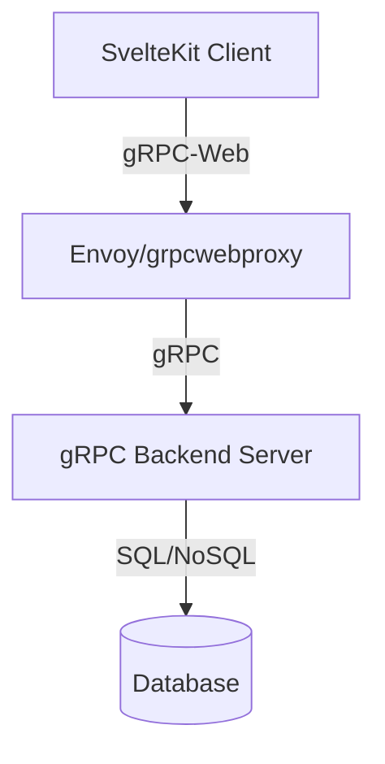

# [Fair n Square] - Technical Design

---

## Tech Stack
- **Frontend**: SvelteKit
- **Backend**: Go
- **API Layer**: gRPC + connectRPC
- **Database**: Postgres (for backend service)
- **Infrastructure**: Fly.io for now

## System Design



## Data Models

### Database Schema
```sql
-- Add your database schema here
```

### Protobuf Definitions
```protobuf
message User {
  string id = 1;
  string email = 2;
  int64 created_at = 3;
}
```

## gRPC Service Definitions

```protobuf
service UserService {
  rpc CreateUser(CreateUserRequest) returns (User);
  rpc GetUser(GetUserRequest) returns (User);
  rpc ListUsers(ListUsersRequest) returns (ListUsersResponse);
  rpc UpdateUser(UpdateUserRequest) returns (User);
  rpc DeleteUser(DeleteUserRequest) returns (google.protobuf.Empty);
}

message CreateUserRequest {
  string email = 1;
  string name = 2;
}

message GetUserRequest {
  string id = 1;
}

message ListUsersRequest {
  int32 page_size = 1;
  string page_token = 2;
}

message ListUsersResponse {
  repeated User users = 1;
  string next_page_token = 2;
}

message UpdateUserRequest {
  string id = 1;
  string email = 2;
  string name = 3;
}

message DeleteUserRequest {
  string id = 1;
}
```

## API Design Decisions

### Authentication
- [ ] Decision on auth mechanism (JWT in metadata, session-based, etc.)
- [ ] Token refresh strategy
- [ ] Authorization model (RBAC, ABAC, etc.)

### Error Handling
- gRPC status codes mapping
- Error message structure
- Client-side error handling strategy

### Streaming
- [ ] Unary calls only
- [ ] Server streaming for [use case]
- [ ] Client streaming for [use case]
- [ ] Bidirectional streaming for [use case]

## Development Setup

### Prerequisites
```bash
- Protocol Buffers compiler (protoc)
- gRPC tools
- [Backend language/runtime]
- Node.js (for SvelteKit)
```

### Project Structure
```
project/
├── proto/              # .proto files
├── backend/           # gRPC server
├── frontend/          # SvelteKit app
└── docs/             # Documentation
```

### Running Locally
```bash
# Generate protobuf code
make proto

# Backend
cd backend && [commands to run gRPC server]

# gRPC-Web Proxy (if needed)
[commands to run proxy]

# Frontend
cd frontend && npm run dev
```

### Testing
- Unit tests for gRPC services
- Integration tests
- gRPC reflection for testing (Evans CLI, grpcurl)

## Open Questions & Decisions
- [ ] Monorepo vs separate repos for frontend/backend?
- [ ] Which gRPC-Web proxy: Envoy or grpcwebproxy?
- [ ] Authentication: JWT in metadata vs session-based?
- [ ] Streaming needs: unary, server streaming, or bidirectional?
- [ ] Database choice and migration strategy
- [ ] Deployment architecture (containers, serverless, etc.)

## Changes & Iterations

### [Date] - Version 0.2
- Changed X because Y
- Refactored Z based on implementation learnings

### [Date] - Version 0.1
- Initial technical design
