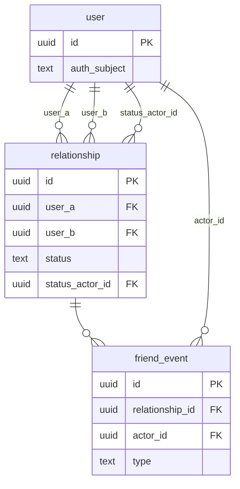

# Core — Database ERD

This is the schema owned by the **core** service. Only the columns needed to understand
relationships (primary keys and foreign keys) are shown; see the migrations in the `core`
repo for the full column list.

## Lean by design

Core does **not** own user identity or profile data. Authentication is handled by an external
provider (**WorkOS**) and the canonical user record + profile live in the separate **Authx**
service (see ADR-2 and ADR-4). The `user` table here is only a local reference:

- `id` — our own generated UUID, which every foreign key points at. We own this keyspace, so
  it never depends on the auth provider (the provider must be swappable per ADR-4).
- `auth_subject` — the external auth subject (the token `sub` / Authx user id). This is the
  only external identifier we store; no name, email, phone, or other profile data.

All foreign keys to `user` cascade on delete, so removing a user automatically removes their
relationships and event history. Token validation / auth middleware is deferred to **FNS-87**;
until then core simply receives a user id.

## Relationship lifecycle

Friendships use a **current-state + history** model rather than a single overloaded table:

- **`relationship`** holds the *current* state for a pair of users — exactly one row per pair.
  The pair is ordered once at creation (`CHECK (user_a < user_b)`) and a plain
  `UNIQUE (user_a, user_b)` enforces uniqueness, so there is no `LEAST/GREATEST` expression
  index. `status` (`pending` → `accepted`/`rejected`/`cancelled`/`blocked`) is plain `text`
  guarded by a `CHECK` constraint, so adding a new state is a one-line migration rather than an
  enum alteration. `status_actor_id` records *who* caused the current status (e.g. the requester
  while `pending`, the blocker while `blocked`), which is how direction is preserved despite the
  ordered, symmetric pair.
- **`friend_event`** is the append-only history — one row per lifecycle action
  (`requested`, `accepted`, `rejected`, `cancelled`, `blocked`, `unblocked`), each carrying the
  `actor_id` who performed it. Request, friendship, and block are all just events on the same
  relationship instead of separate tables.

Creating a relationship (and its first event) and updating a status (and appending an event) are
each two writes wrapped in a single transaction at the service/repository layer, keeping current
state and history consistent.

## Future modules

Groups, expenses, and other domains will be added to this ERD as they are built. Today the schema
covers users and friendships only.
