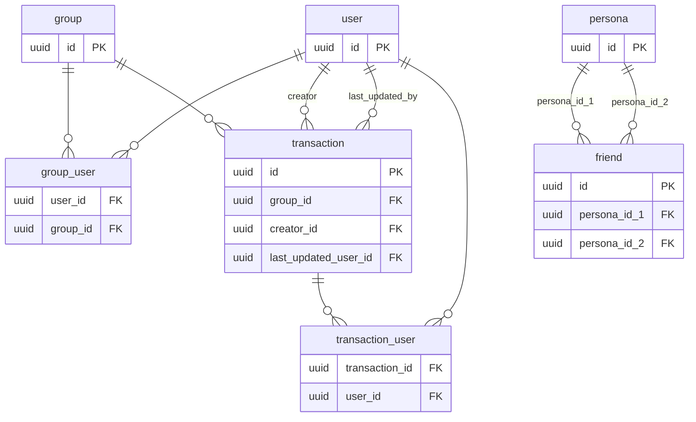

```mermaid
erDiagram
    group {
        uuid id PK
    }
    user {
        uuid id PK
    }
    group_user {
        uuid user_id FK
        uuid group_id FK
    }
    transaction {
        uuid id PK
        uuid group_id FK
        uuid creator_id FK
        uuid last_updated_user_id FK
    }
    transaction_user {
        uuid transaction_id FK
        uuid user_id FK
    }
    persona {
        uuid id PK
    }
    friend {
        uuid id PK
        uuid persona_id_1 FK
        uuid persona_id_2 FK
    }

    group ||--o{ group_user : ""
    user ||--o{ group_user : ""
    group ||--o{ transaction : ""
    user ||--o{ transaction : "creator"
    user ||--o{ transaction : "last_updated_by"
    transaction ||--o{ transaction_user : ""
    user ||--o{ transaction_user : ""
    persona ||--o{ friend : "persona_id_1"
    persona ||--o{ friend : "persona_id_2"
```
