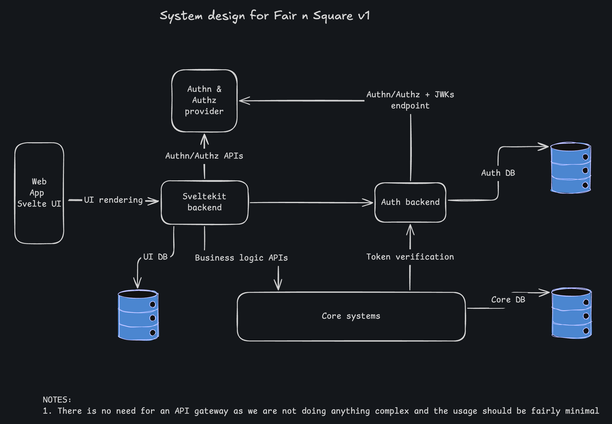

# 2. System Design v1

## Context

For building fair-n-square, we want to start with a simple system design that can help us to define system boundaries, identify systems that need to be built, and how these systems will interact with each other.

## Decision

We will be using a simple microservices based architecture. We will have the following systems:

- UI Frontend: SvelteKit based web app
- UI Backend: Sveltekit backend for simplifying frontend to be responsive and fast. Leverages SSR. Will likely integrate with Firebase for notifications in the future.
- There will be no API gateway in the beginning. Frontend will directly interact with backend services
- Auth Service: Handle user authentication and authorization. We will use third party service like WorkOS or Firebase to get authentication.
- Auth DB: We would want to store user profile data. This will also be responsible for handling user sessions, maintaining user profile data, user preferences etc.
- Core Service: Handles core business logic and data. This system will not handle user profile data.
- Core DB: This will be responsible for storing core business data.
- Authentication/Authorization provider: We will likely use WorkOS for this.

The following diagram illustrates the system design. This is created using excallidraw.

You can import this [excalidraw file](./../diagrams/Fair-n-square-whiteboard.excalidraw) into excalidraw to edit it.

### UI

We will use SvelteKit for UI. It will be a webapp and the layout will be focused on mobile first. We also will leverage server side rendering to make the app faster to load and will use service workers in the future to make it work offline.

Points to consider:

- We want to set clear boundaries for what SvelteKit will be used for. It only focuses on UI related problems. All the business logic will be handled by core service or Auth service.
- We don't want SvelteKit frontend to interact with Core service much. Most of the data should be rendered by SvelteKit backend. UI could interact with other systems in exceptional scenarios as long as it is documented and justified with why alternatives don't work.
- We will use SvelteKit backend to directly login/signup users. Sveltekit will manage user sessions. It will interact with Auth service to CRUD user profile data. The sessions will be managed in its own DB.

### Auth Service

The Auth Service will be very critical and will also be most interacted with service. It will be responsible for:

- Interacting with 3rd party authentication/authorization provider for authorization most of the time.
- interacting with WorkOS for authentication. Auth service is mostly responsible for managing user profile data.
- providing an interface for Fine-grained authorization. We will also evaluate workOS FGA/openFGA/permit.io etc in the future. The idea is that we want to decouple Authorization and also learn to implement ReBAC policy.
- getting M2M tokens for core service to interact with auth service on behalf of users.
- storing JWKs from the auth provider and will host it to validate tokens by other services.
- providing APIS for managing user profile data.
- Auth service will evolve as needed. This scope is just to get started.

### Core Service

The core service will identify and implement core business logic. It will be responsible for:

- providing APIs for core business logic
- interacting with Auth service to
  - validate tokens
  - get group/user permissions for operations
- treating user as a resource and not storing user profile data. We only want to store user id as reference and only store business data related to application
- provide APIs for store/fetch user groups, transactions/ledgers, manage friends, group task list, group settings etc.
- adding features in the future. We will treat core service as a monolith for all the business logic. No need to break it down into smaller services, rather keep the code modular and clean with clear boundaries to manage complexity.
- Most of the APIs should be based on gRPC for better performance, better schema management, strong data types, and using multiple proto services per feature set. Standard APIs can be used in rare cases using connectRPC's API.

## Consequences

There are a few things that should be noted here.

- We will manage multiple services. It is not advised to use multiple services for a simple application. The purpose of doing so is to dive deep into advanced concepts and learn how to build complex systems.
- We will need to manage deployments, CI/CD, monitoring, logging etc for multiple services.
- We might also need to host/maintain dependent services like authorization service, databases etc.
- We should leverage services which has free tier for OSS projects to minimise cost.

### Positive

- Good learning experience
- Using advanced concepts that can be used in bigger projects too
- Clear boundaries for different systems
- Easier to manage codebase as each service has clear responsibility

### Negative

- Increased complexity in managing multiple services. It takes a lot longer to setup CI/CD for multiple services
- Will have to think if we need something like k8s to manage multiple services. Then comes the complexity of managing k8s cluster, designing control plane/data plane and making services/network secure.
- A lot of boilerplate for gRPC + REST and to manage multiple repos at the same time.
- Increased cost of hosting multiple services.
- Need to think about telemetry for distributed systems
- Need to be careful with security as multiple services increase attack surface
- Have to handle networking between services

## Alternatives Considered

There are a few alternatives that were considered.

- We could have used a monolithic architecture, but that would not have given us the learning opportunity to build complex systems.
- We also could have used serverless architecture, but that would have limited our control over the system and would not have given us the opportunity to learn about managing services.
- We could have used something like Firebase for everything, but it is not something that would be used for enterprise applications or applications at scale. It becomes very costly very fast and also has limitation on fine-tuning individual systems.

## References

- What is authorization service: https://workos.com/blog/what-is-authorization

## Change Record

| Date       | Author         | Description      |
| ---------- | -------------- | ---------------- |
| 2025-10-07 | Jaspreet Singh | Initial creation |
