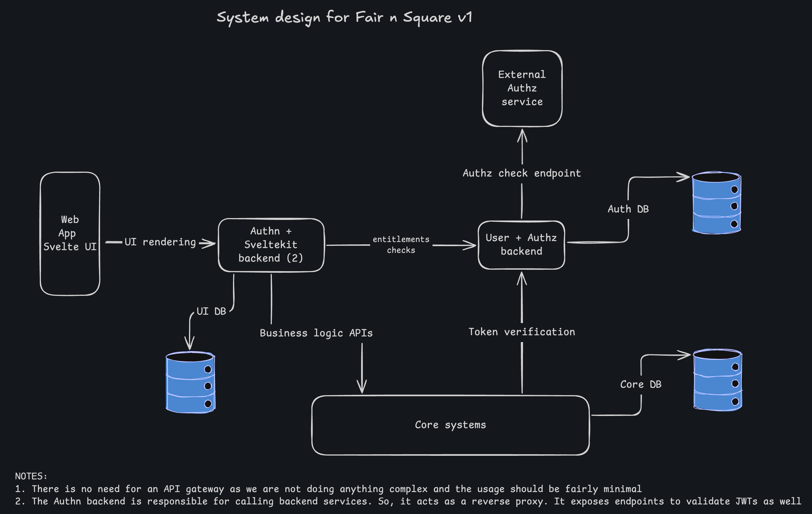

# 3. Use Better Auth for Authentication

## 🔍 Context

In our initial system design (ADR-2), we planned to use third-party services like WorkOS or Firebase for authentication. As we evaluate our authentication requirements and architecture, we need to reconsider this approach to reduce external dependencies while maintaining flexibility and control over our authentication system.

We want to:
- Reduce dependency on external authentication providers
- Have more control over authentication flows and user management
- Leverage SvelteKit backend capabilities for authentication-related operations
- Create M2M (Machine-to-Machine) tokens for service-to-service communication
- Keep the authorization service separate for complex entitlement checks

## ✅ Decision

We will use Better Auth as our authentication library instead of WorkOS or Firebase for handling user authentication.

Better Auth will be integrated into our SvelteKit backend and will:
- Handle user authentication (sign-up, sign-in, password reset, etc.)
- Manage user sessions
- Generate and validate JWT tokens for authenticated users
- Create M2M tokens for service-to-service authentication
- Store user credentials

We will continue to use a separate Authx(user) Service for:
- Fine-grained authorization and entitlement checks
- Role-based and Relationship-based Access Control (ReBAC)
- Complex permission evaluations
- User profile management
- Integration with authorization frameworks (e.g., OpenFGA, Permit.io) in the future

## 🎯 Consequences

### ➕ Positive

- **Reduced External Dependencies**: One less third-party service to depend on, reducing vendor lock-in and potential service outages
- **Cost Optimization**: Eliminates recurring costs associated with WorkOS or Firebase authentication
- **Full Control**: Complete control over authentication flows, user data, and customization
- **Seamless Integration**: Better Auth is designed to work natively with SvelteKit, providing better developer experience
- **Flexibility**: Easier to implement custom authentication features and M2M token generation
- **Open Source**: Better Auth is open source, allowing us to inspect, modify, and contribute to the codebase
- **Type Safety**: Built with TypeScript, providing excellent type safety and autocomplete in our SvelteKit backend
- **Modern Features**: Supports modern authentication patterns including social logins, 2FA, and passwordless authentication

### ➖ Negative

- **Self-Managed Security**: We are now responsible for ensuring authentication security best practices
- **Maintenance Burden**: Need to keep Better Auth updated and monitor for security vulnerabilities
- **Initial Setup Complexity**: More initial setup required compared to using a managed service
- **Feature Development**: Some advanced features (like enterprise SSO) might require additional implementation work
- **Testing Responsibility**: Need to thoroughly test authentication flows and security measures

### Migration Impact

Since this decision is being made early in the development cycle, there should be minimal migration impact. However, we need to:

- Update system architecture diagrams to reflect Better Auth integration
- Design the Auth DB schema for Better Auth user storage
- Implement M2M token generation and validation mechanisms
- Document authentication flows and security measures
- Set up proper logging and monitoring for authentication events

## Implementation Notes

### Authentication Flow
1. User submits credentials via SvelteKit frontend
2. SvelteKit backend uses Better Auth to validate credentials
3. Better Auth generates JWT token and creates session
4. Session stored in Auth DB
5. JWT token returned to frontend for subsequent requests

### M2M Authentication
1. Core Service requests M2M token from Auth Service
2. Auth Service validates service credentials
3. Better Auth generates service-specific JWT token with appropriate scopes
4. Core Service uses M2M token to authenticate with Auth Service

### Authorization Flow (Unchanged)
1. Request arrives with JWT token
2. Token validated by Auth Service
3. Authorization Service evaluates permissions/entitlements
4. Decision returned to requesting service

## 🔄 Alternatives Considered

### Use Supabase Auth

**✅ Pros:**
- Open source alternative to Firebase with an option to self host
- Dedicated authentication service
- Good developer experience

**❌ Cons:**
- Still an external dependency
- Less control compared to self-managed solution

### Continue with WorkOS

**✅ Pros:**
- Enterprise-ready with built-in SSO support
- Managed service with guaranteed uptime
- Comprehensive documentation and support
- Advanced features like directory sync

**❌ Cons:**
- Vendor lock-in
- Less control over authentication flows
- Additional external dependency

### Continue with Firebase Authentication

**✅ Pros:**
- Easy to set up and use
- Well-documented with large community
- Generous free tier
- Integrated with other Firebase services

**❌ Cons:**
- Vendor lock-in with Google ecosystem
- Limited customization options
- Can become expensive at scale
- Additional external dependency

### Build Custom Authentication from Scratch

**✅ Pros:**
- Complete control over every aspect
- No external dependencies
- Fully customizable

**❌ Cons:**
- High security risk if not implemented correctly
- Time-consuming to build and maintain
- Reinventing the wheel
- Requires deep security expertise

### Auth0/Clerk

**✅ Pros:**
- Modern authentication platforms
- Good developer experience
- Comprehensive features

**❌ Cons:**
- Expensive at scale
- External dependency
- Vendor lock-in
- Overkill for our current needs

## Updated System design

You can import this [excalidraw file](./../diagrams/Fair-n-square-whiteboard.excalidraw) into excalidraw to edit it.

## 📚 References

- [Better Auth Documentation](https://www.better-auth.com/)
- [Better Auth with SvelteKit](https://www.better-auth.com/docs/integrations/svelte-kit)
- [JWT Best Practices](https://datatracker.ietf.org/doc/html/rfc8725)
- [OWASP Authentication Cheat Sheet](https://cheatsheetseries.owasp.org/cheatsheets/Authentication_Cheat_Sheet.html)

## 📝 Change Record

| Date       | Author         | Description      |
| ---------- | -------------- | ---------------- |
| 2025-10-11 | Jaspreet Singh | Initial creation |
